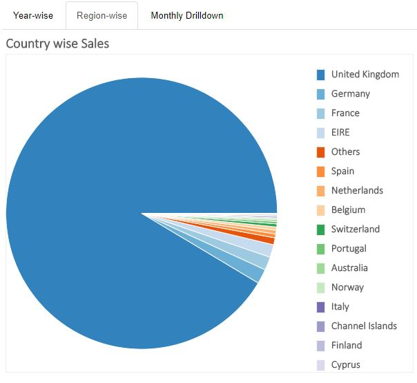
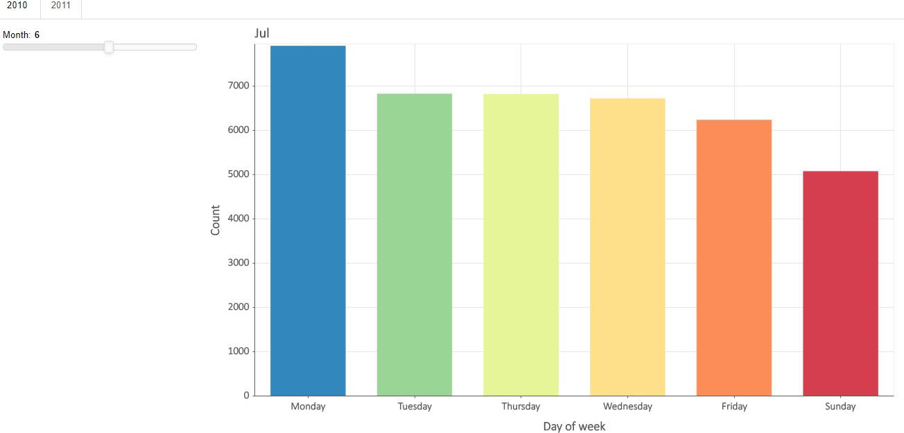

# Bokeh-Dashboard
A realtime dashboard story with interactive charts developed using Bokeh framework

Usage:-

`docker build -t <bokeh-db>`
    
`docker run -d -p 5959:5959 bokeh-db`

URL: [link](http://127.0.0.1:5959)

Dashboard
1. Year-wise sales

2. Region-wise sales

3. Day-wise sales

